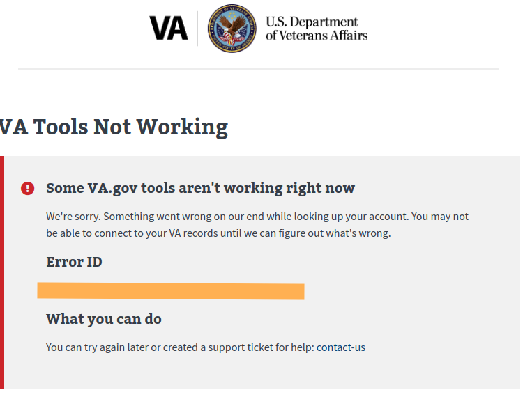
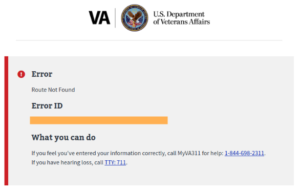
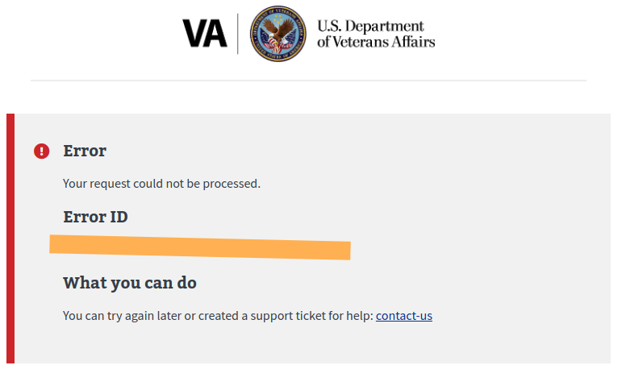
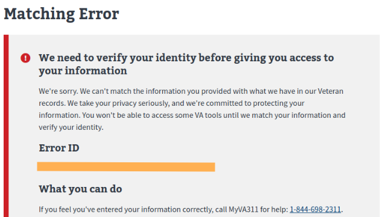

# lighthouse-saml-proxy regression tests

## Quick Start

```sh
export SAML_PROXY_URL={ ex. http://localhost:7000 }
export IDP={ idp }
export CLIENT_ID={ client id }
export USER_PASSWORD={ user password }
export AUTHORIZATION_URL={ ex. https://sandbox-api.va.gov/oauth2 }
export VALID_USER_EMAIL={ ex. va.api.user+idme.001@gmail.com }
export ICN_ERROR_USER_EMAIL={ ex. va.api.user+idme.049@gmail.com }
export HEADLESS={ 0 (false) or 1 (true) } // note: this value only is important for local runs
```

**local**

```js
npm i
npm test
```

**docker**

```sh
docker build -f Dockerfile.test . -t vasdvp/lighthouse-saml-proxy-tests

docker run \
    --rm \
    --network="container:$CONTAINER_ID" \
    vasdvp/lighthouse-saml-proxy-tests \
    --saml-proxy-url=$SAML_PROXY_URL \
    --client-id=$CLIENT_ID \
    --idp=$IDP \
    --authorization-url=$AUTHORIZATION_URL \
    --user-password=$USER_PASSWORD \
    --valid-user=$VALID_USER_EMAIL \
    --icn-error-user=$ICN_ERROR_USER_EMAIL
```

**Note**: the network option is only needed if you are running the test against a local saml proxy. Because our auth servers determine the saml-proxy url based on the idp, the docker version of the regression tests will only work against local instances of the saml proxy if they are running via docker. It is recommended to run the tests locally if possible.

## SAML Proxy Tests

Not all tests that should be performed on the Saml-Proxy are covered in this repository. 

- Happy Path [x]
- Empty SSO call [x]
- MVI ICN error [ ] (Cannot find test user that fails MVI lookup, can be created with proper config changes)
- MVI Internal error [x]
- Invalid LOA [ ] (Cannot be implemented until proper test user is setup)
- Basic Saml Modify [x]
- Signature Wrapping Attacks 1 -8 [ ]
- Replay Attack [x]
- XXE Attack [ ]
- Comment Truncation Attack [ ]

## SAML PROXY ERRORS

## Internal Failure

These errors consists of failures within the VA system. They may be from the Saml Proxy or another system such as MVI.

### Contents

- VA Formatting
- VA Tools not working message
- Request ID
 


## Error

These are general errors. It is usually caused by invalid input. They display messages to help the user trouble shoot their issue.

### Contents

- VA Formatting
- Error Description
- Request ID




## Sensitive Error

These errors contain information that should not be exposed publicly, such as information about an attack being prevented.

### Contents

- VA Formatting
- General Error Message
- Request ID



## ICN

This error occurs when the VA cannot retrieve an ICN from its internal IDPs.

### Contents

- VA Formatting
- Matching error message
- Request ID



## Errors -> Templates

The following is a list of common errors and the template type that they are expected to render.

**Matching Error**

- ICN
- Internal Failure

**Invalid XML**

- Sensitive Error

**Modify SAML**

- Sensitive Error

**XSW Attacks**

- Sensitive Error

**Replay**

- Sensitive Error

**Empty Request**

- Sensitive Error

**Invalid Request**

- Sensitive Error

**404**

- Error
